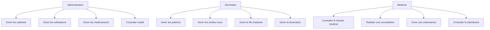

# Cas d'utilisation

## Parcours principal

1. L'administrateur cree un cabinet et ses comptes.
2. La secretaire cree ou retrouve le patient.
3. Elle planifie un rendez-vous sans conflit de creneau.
4. A l'arrivee, elle place le patient dans la file d'attente.
5. Le medecin appelle le patient et ouvre une consultation.
6. Le medecin complete le dossier, pose son diagnostic et cree l'ordonnance.
7. La secretaire enregistre le paiement et imprime la facture.
8. Le systeme journalise chaque action sensible.

## Cas alternatifs indispensables

- compte ou cabinet inactif ;
- patient deja existant ;
- rendez-vous dans le passe ;
- creneau du medecin deja occupe ;
- patient absent ou rendez-vous annule ;
- consultation urgente sans rendez-vous ;
- facture annulee avec motif ;
- acces interdit a un dossier d'un autre cabinet.
