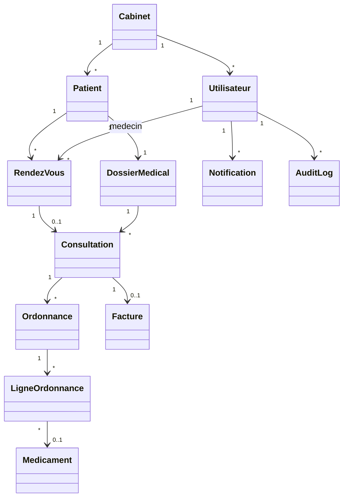

# Diagramme de classes metier

## Enumerations

- `Role` : ADMIN, SECRETAIRE, MEDECIN.
- `StatutCompte` : ACTIF, INACTIF.
- `StatutRendezVous` : EN_ATTENTE, CONFIRME, ARRIVE, EN_CONSULTATION, TERMINE, ANNULE, ABSENT.
- `StatutFacture` : EN_ATTENTE, PAYEE, ANNULEE.
- `ModePaiement` : ESPECES, CARTE, CHEQUE, VIREMENT, ASSURANCE.
- `TypeOrdonnance` : MEDICAMENTS, EXAMENS.
